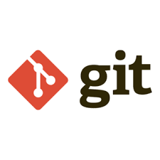
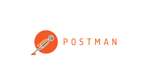

# Hey! I'm Carolanne Devlin-McLean 👋 Welcome to my GitHub 

## ❔ **Who Am I** ❔

+ I am an aspiring FullStack Developer
+ Autumn 2024 Graduate of **_Code First Girls_**' FullStack Development Nano Degree
+ Where I received an 80% pass with a Merit 🥳
+ Working on personal projects, **and** collaborating with others in a really cool gaming catalogue REACT appplication!

## What Skills Do I Currently Have? 🔍

   
  
 

**_and much more..._**

## Projects I have worked on so far...📚

+ Pokemon Top Trumps game 
+ A Car Rental Website built using HTML, JS and CSS 
+ A React Application which matches Spftware Developers to Projects they can collaborate on with others 
+ and currently collaborating on a Gaming Catalogue React Application.

## Just the beginning... 
Early in 2024, I first discovered my passion and love for coding. So I'm still very new and at the beginning of this wonderful journey. I'm learning almost every day, taking on new concepts, learning new skills and challenging the knowledge and skills already acquired. 

Happy to connect and collaborate on projects! 

[Click this link to connect with me on LinkedIn!](https://www.linkedin.com/in/carolanne-devlin-mclean-9b283a30b/)

**_Happy Coding!_**

<!--
**cdevm/cdevm** is a ✨ _special_ ✨ repository because its `README.md` (this file) appears on your GitHub profile.

Here are some ideas to get you started:

- 🔭 I’m currently working on ...
- 🌱 I’m currently learning ...
- 👯 I’m looking to collaborate on ...
- 🤔 I’m looking for help with ...
- 💬 Ask me about ...
- 📫 How to reach me: ...
- 😄 Pronouns: ...
- ⚡ Fun fact: ...
-->
